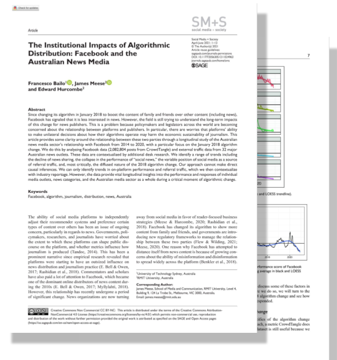

class: inverse, center, middle

# Introduction

---

.pull-left[

I research the impact of Internet technologies and services on politics. 

I have a strong methodological focus on 

* **quantitative** and **computational** methods and 

* **cross-disciplinary collaborations**.   

I completed my PhD in 2017 at the University of Sydney with a thesis on Italy's Five Star Movement. 

* **2018-19** Postdoctoral Fellow in Digital Media Methods, Media and Communications, the University of Sydney

* **2019-2023** Lecturer Digital and Social Media, School of Communication, University of Technology Sydney

* **2019-2023** Lecturer in Data Analytics in the Social Sciences, School of Social and Political Sciences, the University of Sydney

]

.pull-right[

]

---
class: inverse
background-image: url(world.png)
background-size: cover

.pull-left[

.center[
 
]

]

.pull-right[

## Experience out of academia

* **2009-11** Specialist in Business Development for FAO in San Marcos, Guatemala 

* **2011-12** National program manager in Afghanistan for French NGO Madera

* **2012-13** Survey consultant the for the Australian Centre for International Agricultural Research (ACIAR)

* **2017-18** Survey consultant for the Cambodia Development Resource Institute (CDRI), Phnom Penh, Cambodia.
]

---

class: inverse, center, middle

# Research 

---

## Lines of research

### 1. Emergence, interaction, and diffusion of **political opinions** online

.center[

]

### 2. Impacts of social media technologies and services on **political participation and organisation**

---

### Lines of research

.pull-left[

#### 1. Emergence, interaction, and diffusion of **political opinions** online
* Cross-disciplinary research: Digital ethnography, Computer science and Political science. 
* Loops involving Qualitative, Quantitative & Computational methods.
* **Key concepts**: Cloud platforms, Information disorder. 
  
#### 2. Impact of social media technologies and services on **political participation and organisation**
* Political science research: Parties, Movements, Campaigns and Elections.
* Qualitative, Quantitative & Computational methods.
* **Key concepts**: Discontent, Turbulence, Polarisation. 

]

.pull-right[

.center[

]

]

---

class: inverse, center, middle

# 1. Emergence, interaction, and diffusion of **political opinions** online 

---

### 1. Emergence, interaction, and diffusion of **political opinions** online: Questions and challenges

The *Cloud* layer (Bratton, 2016) is the extensive network infrastructure powered by Internet technologies and services (e.g. social media).

#### Key research questions

* What opinions do **emerge** online, but also when and where?

* How do opinions **interact** with other opinions through the Cloud and its online communities?

* What factors determine the speed and reach of the **diffusion** of opinions? 

#### Key methodological challanges

* How to collect complete data about social media interactions?
  * API, web scraping, platforms' research tools, third-parties research tools... 
  
* How to collect representative data?

* How to create collaborative tools? 
  * Interface between qualitative data and quantitative/machine-ready data 

---

### Wikibase as a collaborative research tool for structure and unstructured data

.center[
<video width="900" height="500" controls autoplay loop>
  <source src="social-sense-wikibase-imovie.mp4" type="video/mp4">
</video>
]

---

### 1. Emergence, interaction, and diffusion of **political opinions** online: Impacts and stakeholders

#### Research impacts

* Improving the functioning of social media platforms (e.g. engagement vs discussion quality)

* Understanding how to regulate social media platforms (e.g. data ownership)

* Understanding how, when and where to intervene on social media platforms

* Understanding how to protect vulnerable groups and institutions

#### Key stakeholders

* Social media platforms

* Public institutions

---

### 1. Emergence, interaction, and diffusion of **political opinions** online: Recent publications

.pull-left[

Kong, Q., Booth, E., Bailo, F., Johns, A., & Rizoiu, M.-A. (2022). Slipping to the extreme: A mixed method to explain how extreme opinions infiltrate online discussions. *Proceedings of the International AAAI Conference on Web and Social Media*, 16(1), 524–535. https://doi.org/10.1609/icwsm.v16i1.19312

.center[

]
]

.pull-right[

Bailo, F., Meese, J., & Hurcombe, E. (2021). The institutional impacts of algorithmic distribution: Facebook and the Australian news media. *Social Media + Society*, 7(2). https://doi.org/10.1177/20563051211024963

.center[

]
]

]

---

### 1. Emergence, interaction, and diffusion of **political opinions** online: Current work

Bailo, F., Johns, A., & Rizoiu, M.-A. (2023). Riding information crises: The performance of far-right Twitter users in Australia during the 2019-20 bushfires and the COVID-19 pandemic. *Information, Communication & Society*. https://doi.org/10.1080/1369118X.2023.2205479

.center[

]

---

### 1. Emergence, interaction, and diffusion of **political opinions** online: Current/Future work

.pull-left[

#### Dashboard to sense and predict social media conversations

.center[

]
]

.pull-right[

#### Social media experiments

.center[

]

#### Crowd-sourcing research data 

.center[

]

]

---

class: inverse, center, middle

# 2. Impact of social media technologies and services on **political participation and organisation**

---

### 2. Impact of social media technologies and services on **political participation and organisation**: Questions 

#### Key research questions

* Can "Internet capital" offset a lack of social capital in facilitating participation and organisation?

  * Does Internet capital facilitate the organisation of political discontent from the margin (low-social capital areas)?

* Do Internet technologies and services create more political instability by facilitating the emergence of new political actors (individuals or organisations)?
  
* Do social media negatively affect the quality of political deliberation? What factors, technologies or services are important in reducing the quality of online conversation? 

---

### 2. Impact of social media technologies and services on **political participation and organisation**: Recent publication

Bailo, F. (2020). *Online communities and crowds in the rise of the Five Star Movement*. Palgrave Macmillan. https://doi.org/10.1007/978-3-030-45508-8

.center[

]

---

### 2. Impact of social media technologies and services on **political participation and organisation**: Current work

Internet-mediated participation (meetups) is associated with a higher frequency of political talks in low-social capital areas.

.center[

]

---
class: inverse, center, middle

# To conclude, some of the data I have been working on ...

---

.pull-left[

### Network data

Recruitment networks of political movements (2018)

.center[
<video height="400" controls autoplay loop>
  <source src="diffusion-over-network.mp4" type="video/mp4">
</video>
]
]

.pull-right[

### Geographic data

Excess mortality (2021)

.center[
<video height="500" controls autoplay loop>
  <source src="excess-mortality.mp4" type="video/mp4">
</video>
]
]

---

### Network data

Twitter communities (2022)

---

### Text data

Opinion co-occurrence network (2022)

---
