class: inverse, center, middle

# Introduction

---

.pull-left[

I research the impact of Internet technologies and services on politics. 

I have a strong methodological focus on 

* **quantitative** and **computational** methods and 

* **cross-disciplinary collaborations**.   

I completed my PhD in 2017 at the University of Sydney with a thesis on Italy's Five Star Movement. 

* **2018-19** Postdoctoral Fellow in Digital Media Methods, Media and Communications, the University of Sydney

* **2019-2023** Lecturer Digital and Social Media, School of Communication, University of Technology Sydney

* **2023-today** Lecturer in Data Analytics in the Social Sciences, School of Social and Political Sciences, the University of Sydney

]

.pull-right[
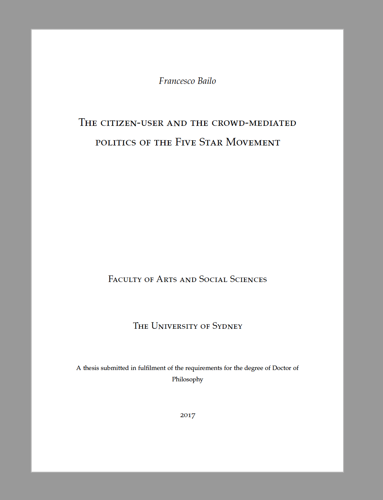
]

---
class: inverse
background-image: url(world.png)
background-size: cover

.pull-left[

.center[
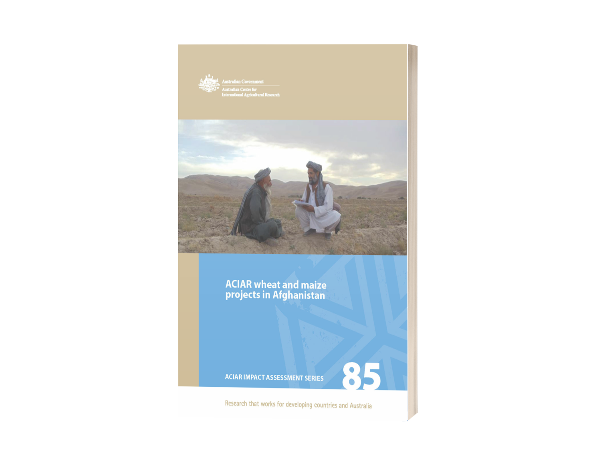 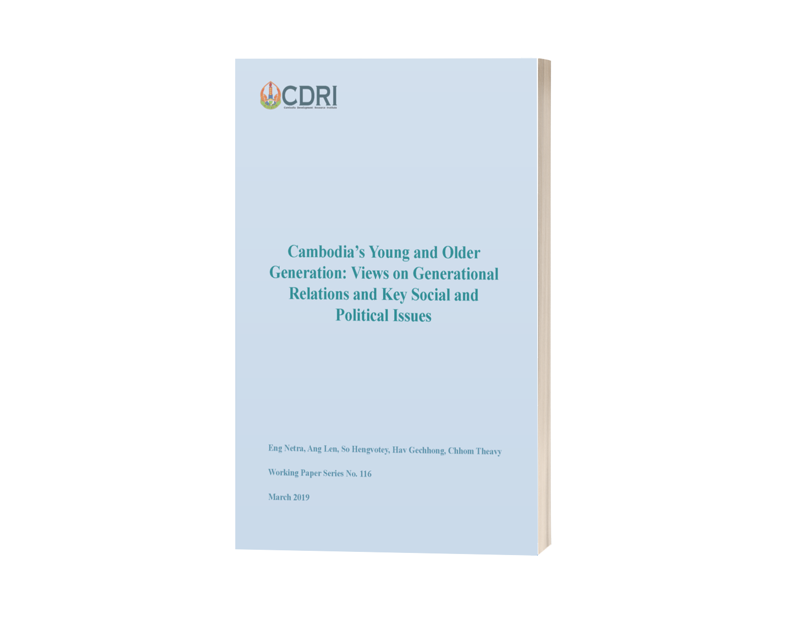
]

]

.pull-right[

## Experience out of academia

* **2009-11** Specialist in Business Development for FAO in San Marcos, Guatemala 

* **2011-12** National program manager in Afghanistan for French NGO Madera

* **2012-13** Survey consultant the for the Australian Centre for International Agricultural Research (ACIAR)

* **2017-18** Survey consultant for the Cambodia Development Resource Institute (CDRI), Phnom Penh, Cambodia.
]

---

class: inverse, center, middle

# Research 

---

## Lines of research

### 1. Emergence, interaction, and diffusion of **political opinions** online

.center[
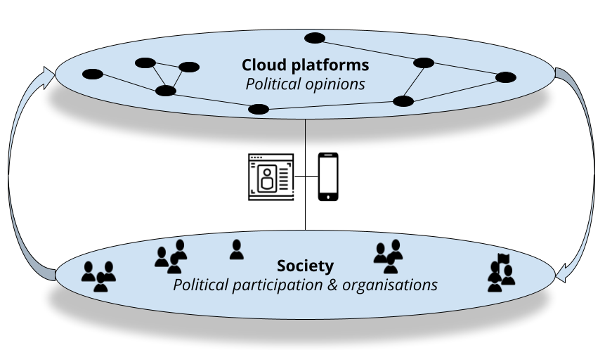
]

### 2. Impacts of social media technologies and services on **political participation and organisation**

---

### Lines of research

.pull-left[

#### 1. Emergence, interaction, and diffusion of **political opinions** online
* Cross-disciplinary research: Digital ethnography, Computer science and Political science. 
* Loops involving Qualitative, Quantitative & Computational methods.
* **Key concepts**: Cloud platforms, Information disorder. 
  
#### 2. Impact of social media technologies and services on **political participation and organisation**
* Political science research: Parties, Movements, Campaigns and Elections.
* Qualitative, Quantitative & Computational methods.
* **Key concepts**: Discontent, Turbulence, Polarisation. 

]

.pull-right[

.center[

]

]

---

class: inverse, center, middle

# 1. Emergence, interaction, and diffusion of **political opinions** online 

---

### 1. Emergence, interaction, and diffusion of **political opinions** online: Questions and challenges

The *Cloud* layer (Bratton, 2016) is the extensive network infrastructure powered by Internet technologies and services (e.g. social media).

#### Key research questions

* What opinions do **emerge** online, but also when and where?

* How do opinions **interact** with other opinions through the Cloud and its online communities?

* What factors determine the speed and reach of the **diffusion** of opinions? 

#### Key methodological challanges

* How to collect complete data about social media interactions?
  * API, web scraping, platforms' research tools, third-parties research tools... 
  
* How to collect representative data?

* How to create collaborative tools? 
  * Interface between qualitative data and quantitative/machine-ready data 

---

### Wikibase as a collaborative research tool for structure and unstructured data

.center[
<video width="900" height="500" controls autoplay loop>
  <source src="social-sense-wikibase-imovie.mp4" type="video/mp4">
</video>
]

---

### 1. Emergence, interaction, and diffusion of **political opinions** online: Impacts and stakeholders

#### Research impacts

* Improving the functioning of social media platforms (e.g. engagement vs discussion quality)

* Understanding how to regulate social media platforms (e.g. data ownership)

* Understanding how, when and where to intervene on social media platforms

* Understanding how to protect vulnerable groups and institutions

#### Key stakeholders

* Social media platforms

* Public institutions

---

### 1. Emergence, interaction, and diffusion of **political opinions** online: Recent publications

.pull-left[

Kong, Q., Booth, E., Bailo, F., Johns, A., & Rizoiu, M.-A. (2022). Slipping to the extreme: A mixed method to explain how extreme opinions infiltrate online discussions. *Proceedings of the International AAAI Conference on Web and Social Media*, 16(1), 524–535. https://doi.org/10.1609/icwsm.v16i1.19312

.center[
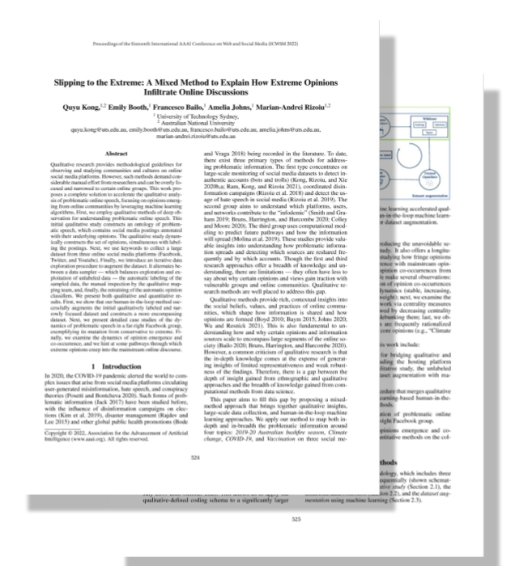
]
]

.pull-right[

Bailo, F., Meese, J., & Hurcombe, E. (2021). The institutional impacts of algorithmic distribution: Facebook and the Australian news media. *Social Media + Society*, 7(2). https://doi.org/10.1177/20563051211024963

.center[
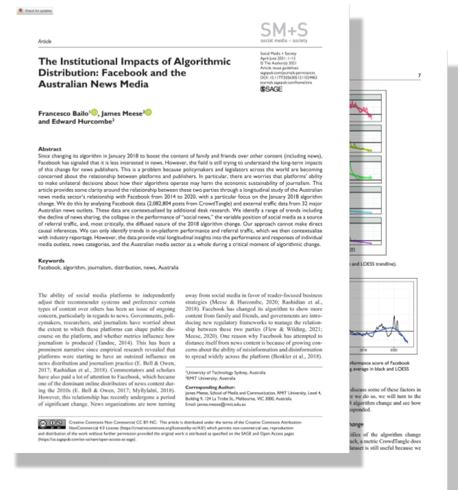
]
]

]

---

### 1. Emergence, interaction, and diffusion of **political opinions** online: Most recent work

Bailo, F., Johns, A., & Rizoiu, M.-A. (2023). Riding information crises: The performance of far-right Twitter users in Australia during the 2019-20 bushfires and the COVID-19 pandemic. *Information, Communication & Society*. https://doi.org/10.1080/1369118X.2023.2205479

* RQ1: Did far-right accounts overperform?

* RQ2: Do we observe a change in the degree of information disorder in the two conversations?

.center[
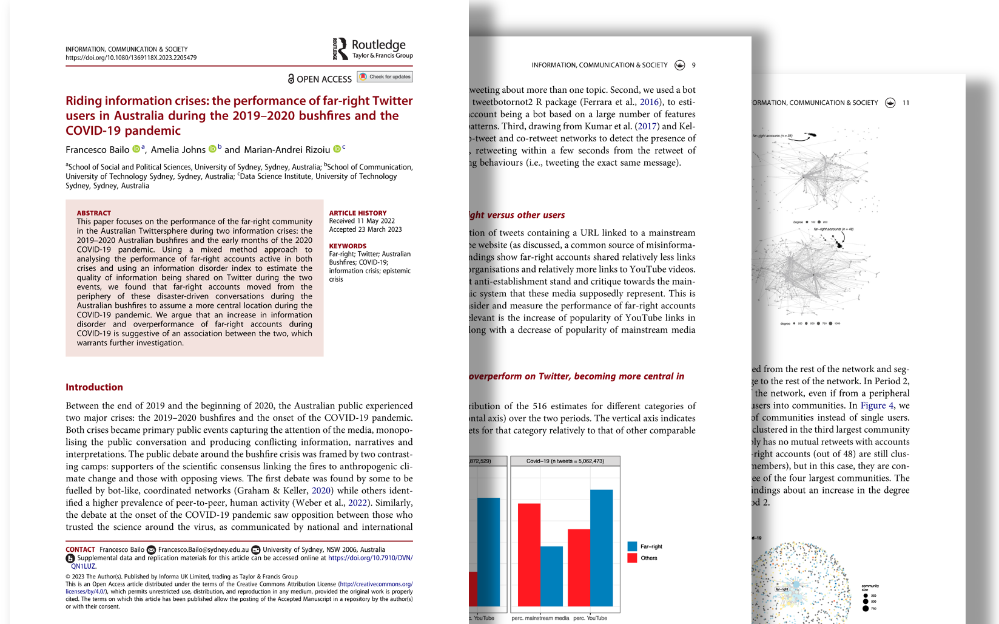
]

---

####  Riding information crises: The performance of far-right Twitter users in Australia during the 2019-20 bushfires and the COVID-19 pandemic (2023)

When we measure the performance of the three categories of accounts, we note that journalists and politicians clearly overperform relative to the control group, but also that far-right accounts overperform quite significantly, *but only at the onset of the pandemic*. Their performance was more limited during the bushfire crisis.

.center[
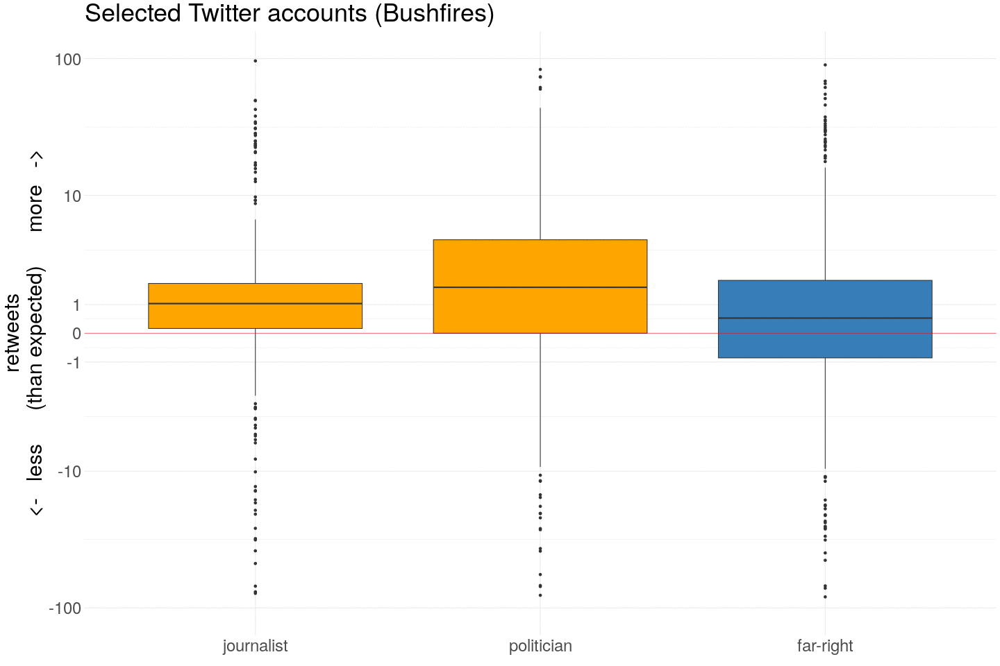
]

---

####  Riding information crises: The performance of far-right Twitter users in Australia during the 2019-20 bushfires and the COVID-19 pandemic (2023)

In support of stronger performance by far-right accounts, we observed that the far-right community maintained a peripheral position during the bushfire crisis ...

.center[

]

---

####  Riding information crises: The performance of far-right Twitter users in Australia during the 2019-20 bushfires and the COVID-19 pandemic (2023)

... and it was only during the pandemic that far-right accounts moved to a more central position in the Twitter conversation. 
 
 .center[

]

---

####  Riding information crises: The performance of far-right Twitter users in Australia during the 2019-20 bushfires and the COVID-19 pandemic (2023)

Our argument suggests that a factor causing the overperformance of the far-right community on Twitter during the pandemic, even following the introduction of stricter content moderation policies, was increased information disorder. 

.center[

]

We measure information disorder on two dimensions capturing the number of web domains that are linked and the proportion of links to authorative sources.

Our index points to a clear increase of information disorder *during the pandemic*.

---

### 1. Emergence, interaction, and diffusion of **political opinions** online: Current/Future work

.pull-left[

#### Dashboard to sense and predict social media conversations

.center[
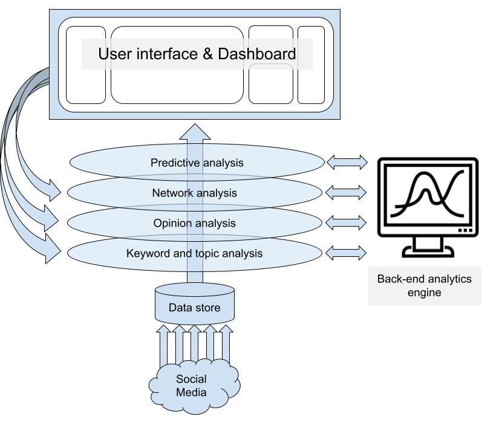
]
]

.pull-right[

#### Social media experiments

.center[

]

#### Crowd-sourcing research data 

.center[

]

]

---

### 1. Emergence, interaction, and diffusion of **political opinions** online: Current/Future work

### More theoretical work on information disorder: How to measure information disorder?

* A measure *information disorder* that is agnostic to **knowledge** (as *true* belief).

* So, information disorder as 

> The likelihood to encounter consistent information to solve a sense-making problem.

#### An example of a sense-making problem: Did Trump win the 2020 election?

Information disorder is *high* if the likelihood of finding conflicting information on the results are *high* (independently from what the information says).

*Ideally, we want to also incorporate the quality of the sources posting the information (e.g. WTO.org vs uncle-pete-does-climate-science.com)*

---

### 1. Emergence, interaction, and diffusion of **political opinions** online: Current/Future work

### More theoretical work on political epistemology. 

* This aims at developing a theory to explain the creation, use and diffusion of politically contentious knowledge on social media. 

* As information traverses a complex social media system embedded in different types of content, it interacts with an **epistemological network** defined by a social, political and media infrastructure *layer*. Knowledge is the *outcome* of this dynamic interaction. 

* Research scope: To assess how each *layer* dynamically contributes to producing individual, collective and even system-wide knowledge. 

* Research impact: To inform the design of social media applications that are resilient to information disorders and the politically motivated diffusion of misinformation.

---

class: inverse, center, middle

# 2. Impact of social media technologies and services on **political participation and organisation**

---

### 2. Impact of social media technologies and services on **political participation and organisation**: Questions 

#### Key research questions

* Can "Internet capital" offset a lack of social capital in facilitating participation and organisation?

  * Does Internet capital facilitate the organisation of political discontent from the margin (low-social capital areas)?

* Do Internet technologies and services create more political instability by facilitating the emergence of new political actors (individuals or organisations)?
  
* Do social media negatively affect the quality of political deliberation? What factors, technologies or services are important in reducing the quality of online conversation? 

---

### 2. Impact of social media technologies and services on **political participation and organisation**: Recent publication

Bailo, F. (2020). *Online communities and crowds in the rise of the Five Star Movement*. Palgrave Macmillan. https://doi.org/10.1007/978-3-030-45508-8

.center[
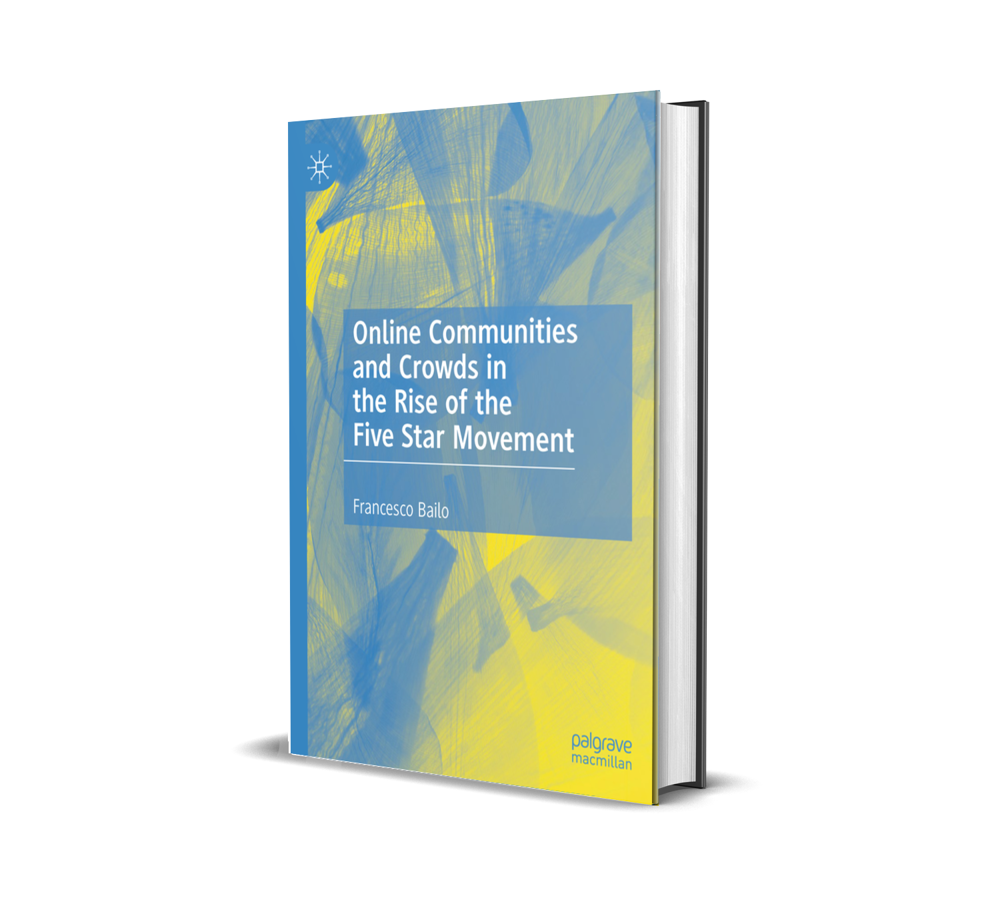
]

---

### 2. Impact of social media technologies and services on **political participation and organisation**: Current work

* *Breaking out of legacy mobilisation networks: How Italy's Five Star Movement activated passive political discontent* (under review)

.center[
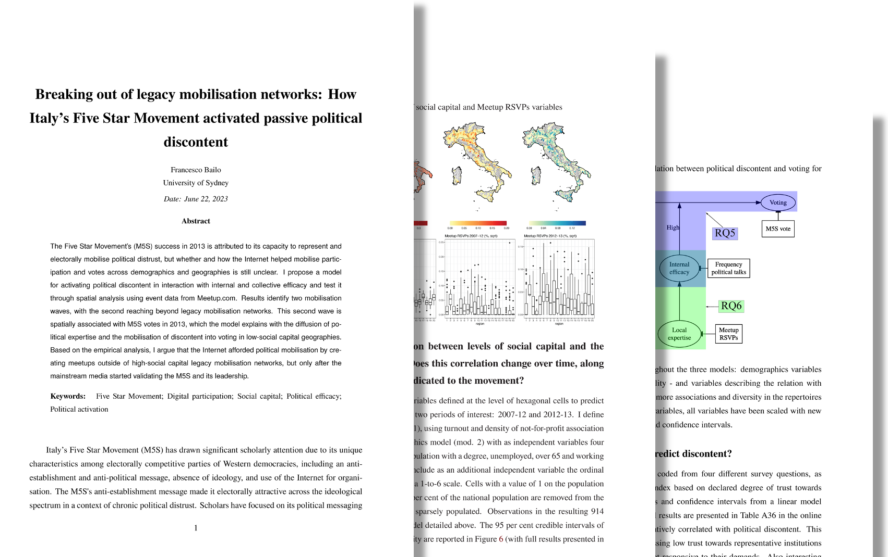
]

---

#### Breaking out of legacy mobilisation networks: How Italy's Five Star Movement activated passive political discontent (under review) 

The Five Star Movement’s (M5S) success in 2013 is attributed to its capacity to represent and electorally mobilise political distrust, but whether and how the Internet helped mobilise participation and votes across demographics and geographies is still unclear. 

I propose a *model* for activating **political discontent** in interaction with **internal and collective efficacy** and test it through spatial analysis using event data from Meetup.com. 

.center[
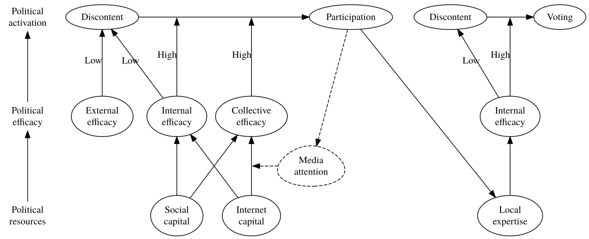
]

---

#### Breaking out of legacy mobilisation networks: How Italy's Five Star Movement activated passive political discontent (under review) 

##### Variables

.center[
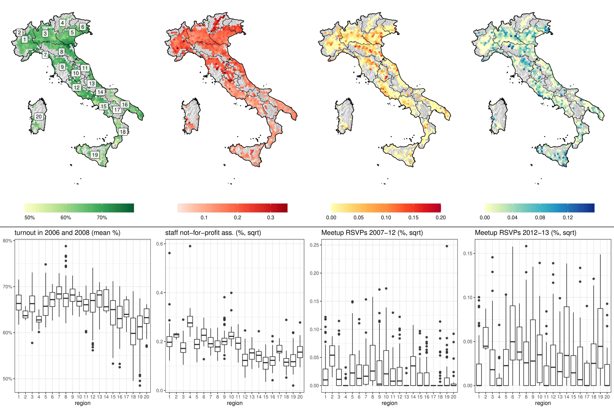
]

---

#### Breaking out of legacy mobilisation networks: How Italy's Five Star Movement activated passive political discontent (under review) 

Results identify *two mobilisation waves*, with the second reaching beyond legacy mobilisation networks. 

* The *first wave* is positively spatially associated with **social capital**.

* The *second wave* is spatially associated with **M5S votes** in 2013 but not anymore with social capital. 

* The model explains with the diffusion of political expertise and the mobilisation of discontent into voting in low-social capital geographies. 

.center[
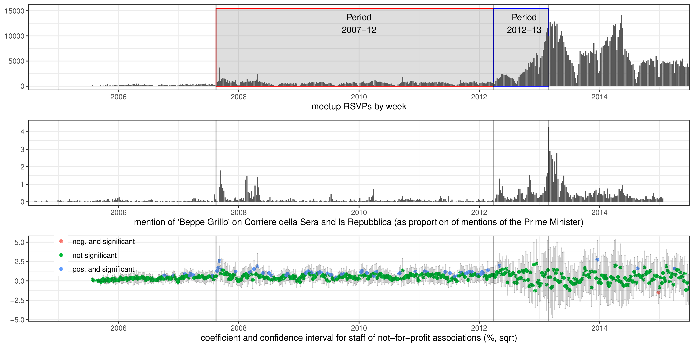
]

---

#### Breaking out of legacy mobilisation networks: How Italy's Five Star Movement activated passive political discontent (under review) 

Based on the empirical analysis, I argue that 

* the Internet afforded political mobilisation by creating meetups outside of high-social capital legacy mobilisation networks, but 

* only after the *mainstream media* started validating the M5S and its leadership.

.center[
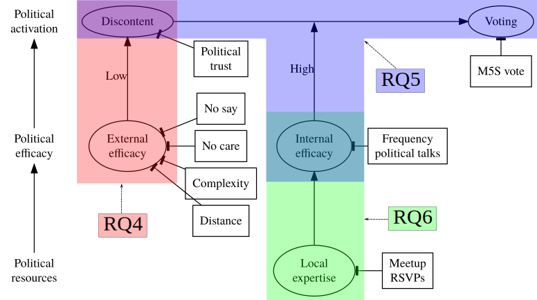
]

---
class: inverse, center, middle

# To conclude, some of the data I have been working on ...

---

.pull-left[

### Network data

Recruitment networks of political movements (2018)

.center[
<video height="400" controls autoplay loop>
  <source src="diffusion-over-network.mp4" type="video/mp4">
</video>
]
]

.pull-right[

### Geographic data

Excess mortality (2021)

.center[
<video height="500" controls autoplay loop>
  <source src="excess-mortality.mp4" type="video/mp4">
</video>
]
]

---

### Network data

Twitter communities (2022)

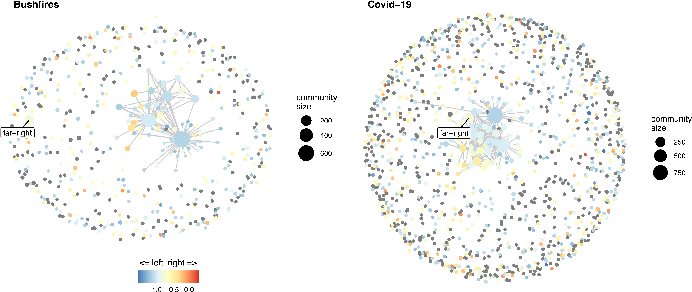
---

### Text data

Opinion co-occurrence network (2022)

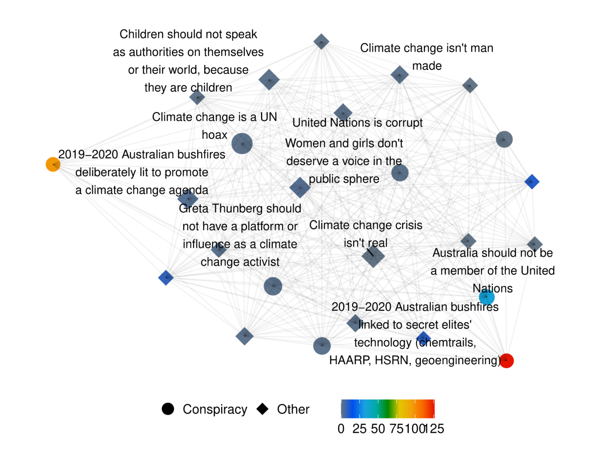
---
